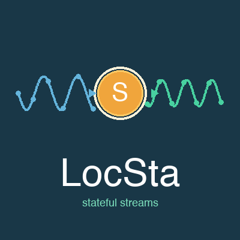

<p align="center">
  
</p>

<h1 align="center">LocSta</h1>

<p align="center">
  <strong>Loc</strong>al <strong>Sta</strong>te — A stateful stream processing library for F#.
</p>

<p align="center">
  <a href="https://fsprojects.github.io/LocSta/">Live Demo</a>
</p>

---

LocSta provides composable, stateful stream blocks using F# computation expressions. Each block is a pure function that threads state automatically, making it easy to build complex signal processing pipelines — from simple counters to full audio DSP chains.

## Core Concept

A `SigStream<'v,'c,'s>` is a function that takes a `StateController` and a context value, and returns a **sequence of output values** along with the updated state. The `stream { }` computation expression composes these blocks, automatically managing state allocation and threading. Streams can emit zero, one, or multiple values per tick using `yield`.

```fsharp
open LocSta.Core

// A simple stateful stream: counter that increments by 1
let myCounter =
    stream {
        let! state = useState 0
        let current = state.Value
        state.Value <- current + 1
        return current
    }

// Evaluate 5 samples (context is unit here)
let result = myCounter |> Eval.run 5 (fun _ -> ())
// result = [0; 1; 2; 3; 4]
```

## Key Primitives

| Primitive | Description |
|---|---|
| `stream { }` | Computation expression builder for composing streams |
| `return` / `yield` | Emit a single value (`yield` allows multi-emit with `Combine`) |
| `yield!` | Forward all values from a sub-stream |
| `getCtx()` | Read the current input/context value |
| `useState value` | Local mutable state, initialized once |
| `useStateWith init` | Local mutable state with lazy initializer |
| `useMemoWith init` | Memoized value (lazy, computed once) |
| `ofSeq sequence` | Create a stream from a sequence (emits empty when exhausted) |
| `map proj stream` | Transform stream output |
| `Eval.run n getCtx stream` | Evaluate n values with a context generator |
| `Eval.runWith inputs stream` | Evaluate with an input sequence |
| `Eval.toSeq getCtx stream` | Convert to a lazy `seq<'v>` (stops after 1000 silent ticks) |
| `Eval.toSeqWith max getCtx stream` | Same with custom silent-tick limit |

## Examples

### Exponential Moving Average

```fsharp
open LocSta
open LocSta.Blocks.Statistics.Ema

let inputs = [1.0; 2.0; 3.0; 4.0; 5.0]
let result = ema 0.5 |> Eval.runWith inputs
// Smoothed output approaching the input signal
```

### Composing Streams

```fsharp
open LocSta
open LocSta.Blocks.Operators

let stream1 = ofSeq [1.0; 2.0; 3.0]
let stream2 = ofSeq [10.0; 20.0; 30.0]
let summed = stream1 .+. stream2
let result = summed |> Eval.run 3 (fun _ -> ())
// result = [11.0; 22.0; 33.0]
```

### Audio: Filtered Sine Oscillator

```fsharp
open LocSta
open LocSta.Blocks.Dsp.Oscillators.SineOsc
open LocSta.Blocks.Dsp.Filters.LowPass1

let sampleRate = 44100.0

let filtered =
    stream {
        let! osc = sineOsc sampleRate
        let! out = lowPass1 sampleRate
        // ... wire osc through filter
        return out
    }
```

### Counting Events

```fsharp
open LocSta
open LocSta.Blocks.Counting.CountWhere

let inputs = [1; 5; 3; 7; 2; 8]
let result = countWhere (fun x -> x > 4) |> Eval.runWith inputs
// result = [0; 1; 1; 2; 2; 3]
```

## Available Blocks

<details>
<summary><strong>Generators</strong></summary>

| Block | Description |
|---|---|
| `counter start increment` | Incrementing counter |
| `fibonacci` | Fibonacci sequence generator |

</details>

<details>
<summary><strong>Delay</strong></summary>

| Block | Description |
|---|---|
| `delayBy1 seed` | Delay signal by 1 sample |
| `delayByN n seed` | Delay signal by n samples |

</details>

<details>
<summary><strong>State</strong></summary>

| Block | Description |
|---|---|
| `hold predicate defaultValue` | Hold last value satisfying predicate |
| `latch gate` | Latch value when gate is true |
| `edge` | Detect rising edges (false &rarr; true) |
| `changed` | Detect value changes |

</details>

<details>
<summary><strong>Arithmetic</strong></summary>

| Block | Description |
|---|---|
| `diff` | Difference between consecutive samples |
| `cumulativeSum` | Running cumulative sum |
| `cumulativeProduct` | Running cumulative product |
| `clamp lo hi` | Clamp to [lo, hi] range |
| `rescale inMin inMax outMin outMax` | Linear rescaling between ranges |

</details>

<details>
<summary><strong>Statistics</strong></summary>

| Block | Description |
|---|---|
| `movingAverage windowSize` | Simple moving average |
| `ema alpha` | Exponential moving average |
| `rollingStdDev windowSize` | Standard deviation over window |
| `rollingMin windowSize` | Minimum over sliding window |
| `rollingMax windowSize` | Maximum over sliding window |
| `runningMin` | All-time running minimum |
| `runningMax` | All-time running maximum |

</details>

<details>
<summary><strong>Detection</strong></summary>

| Block | Description |
|---|---|
| `crossover threshold` | Detect threshold crossings |
| `threshold lo hi` | Hysteresis threshold (Schmitt trigger) |

</details>

<details>
<summary><strong>Logic</strong></summary>

| Block | Description |
|---|---|
| `debounce count` | Debounce boolean signal |
| `toggle` | Toggle on each true input |

</details>

<details>
<summary><strong>Counting</strong></summary>

| Block | Description |
|---|---|
| `countWhere predicate` | Count predicate satisfactions |
| `countSince predicate` | Samples since predicate was last true |
| `countIn windowSize` | Count true values in window |
| `timeSince predicate dt` | Time elapsed since predicate |
| `rate windowSize dt` | Event rate over window |

</details>

<details>
<summary><strong>Windowing</strong></summary>

| Block | Description |
|---|---|
| `windowedReduce windowSize folder seed` | Fold over sliding window |
| `segment predicate` | Segment stream by predicate |

</details>

<details>
<summary><strong>TimeSeries — Types</strong></summary>

| Type | Description |
|---|---|
| `DataPoint<'v>` | A value with a `DateTimeOffset` timestamp |
| `ResampleContext<'v>` | Window of DataPoints with optional before/after neighbors |
| `Resampler<'v,'r>` | `ResampleContext<'v> -> 'r` — aggregation or interpolation function |

</details>

<details>
<summary><strong>TimeSeries — LookBack</strong></summary>

| Block | Description |
|---|---|
| `lookBack1Opt ()` | Previous DataPoint as `voption` (ValueNone on first tick) |
| `lookBack1 default` | Previous DataPoint, padded with default |
| `lookBack2Opt ()` / `lookBack3Opt ()` | Previous 2/3 DataPoints as voption tuple |
| `lookBack2 default` / `lookBack3 default` | Previous 2/3 DataPoints, padded with default |
| `lookBackOpt n` | Previous N DataPoints as `voption list` |
| `lookBack n default` | Previous N DataPoints as `list`, padded with default |

</details>

<details>
<summary><strong>TimeSeries — LookAhead</strong></summary>

| Block | Description |
|---|---|
| `lookAhead1Opt ()` | (current, next) as `voption` — delays 1 tick |
| `lookAhead1 default` | (current, next) — uses default before buffer fills |
| `lookAhead2Opt ()` / `lookAhead3Opt ()` | (current, next1, next2/3) as voption — delays 2/3 ticks |
| `lookAhead2 default` / `lookAhead3 default` | (current, next1, next2/3) padded with default |
| `lookAheadOpt n` | (current, ahead list) as `voption` — delays N ticks |
| `lookAhead n default` | (current, ahead list) — padded with default |

</details>

<details>
<summary><strong>TimeSeries — Window Aggregation</strong></summary>

| Block | Description |
|---|---|
| `window n` | Sliding window of N DataPoints (raw buffer) |
| `windowSum n` | Sum of values in sliding window. Input: `DataPoint<float>` |
| `windowAvg n` | Average of values in sliding window |
| `windowMin n` | Minimum value in sliding window |
| `windowMax n` | Maximum value in sliding window |
| `windowCount n` | Count of values in window (saturates at N) |
| `cumulativeSum ()` | Running total over all values |
| `intervalSum ()` | Cumulative sum that resets on boundary. Input: `(DataPoint<float> * bool)` |

</details>

<details>
<summary><strong>TimeSeries — Interpolation</strong></summary>

| Block | Description |
|---|---|
| `sampleAndHold ()` | Hold last known value at target timestamp. Input: `(DateTimeOffset * DataPoint<'v> voption)` |
| `nearestNeighbor ()` | Pick closest point by timestamp. Input: `(DateTimeOffset * DataPoint<float> voption)` |
| `linear ()` | Linear interpolation between surrounding points. Input: `(DateTimeOffset * DataPoint<float> voption)` |

</details>

<details>
<summary><strong>TimeSeries — Standalone Resamplers</strong></summary>

| Block | Description |
|---|---|
| `Aggregate.last` / `first` / `count` | Last/first value, count in window |
| `Aggregate.sum` / `avg` / `min` / `max` | Numeric aggregations over `ResampleContext` |
| `Interpolate.sampleAndHold` | Hold last known value |
| `Interpolate.nearestNeighbor` | Pick nearest value by timestamp |
| `Interpolate.linear` | Linear interpolation (float only) |

</details>

<details>
<summary><strong>Operators</strong></summary>

| Block | Description |
|---|---|
| `binOp op s1 s2` | Combine two streams with binary operator |
| `s1 .+. s2` | Add two streams |
| `s1 .-. s2` | Subtract two streams |
| `s1 .*. s2` | Multiply two streams |
| `s1 ./. s2` | Divide two streams |

</details>

<details>
<summary><strong>DSP — Oscillators</strong></summary>

| Block | Description |
|---|---|
| `sineOsc sampleRate` | Sine wave oscillator. Input: frequency |
| `sawOsc sampleRate` | Sawtooth oscillator. Input: frequency |
| `squareOsc sampleRate` | Square wave with pulse width. Input: (freq, pulseWidth) |
| `triangleOsc sampleRate` | Triangle wave oscillator. Input: frequency |
| `whiteNoise seed` | Seeded white noise generator |

</details>

<details>
<summary><strong>DSP — Filters</strong></summary>

| Block | Description |
|---|---|
| `lowPass1 sampleRate` | 1-pole RC low-pass. Input: (signal, cutoffHz) |
| `highPass1 sampleRate` | 1-pole high-pass. Input: (signal, cutoffHz) |
| `biquadLowPass sampleRate` | 2nd-order resonant low-pass. Input: (signal, cutoff, q) |
| `biquadHighPass sampleRate` | 2nd-order resonant high-pass. Input: (signal, cutoff, q) |
| `biquadBandPass sampleRate` | 2nd-order band-pass. Input: (signal, cutoff, q) |
| `dcBlock r` | DC blocking filter with configurable R |

</details>

<details>
<summary><strong>DSP — Envelope</strong></summary>

| Block | Description |
|---|---|
| `envFollow attackMs releaseMs sampleRate` | Envelope follower. Input: signal |
| `adsr attackTime decayTime sustainLevel releaseTime` | ADSR envelope generator. Input: gate (bool) |

</details>

<details>
<summary><strong>DSP — Dynamics</strong></summary>

| Block | Description |
|---|---|
| `softClip drive` | Soft clipper via tanh saturation. Input: signal |
| `hardClip threshold` | Hard clipper/limiter. Input: signal |
| `gate threshold` | Noise gate. Input: (signal, envelope) |

</details>

<details>
<summary><strong>DSP — Modulation</strong></summary>

| Block | Description |
|---|---|
| `ringMod s1 s2` | Ring modulator (multiply two streams) |
| `bitCrush bits` | Bit depth reducer. Input: signal |
| `crossfade s1 s2 mix` | Crossfade between two streams |

</details>

<details>
<summary><strong>DSP — Analysis</strong></summary>

| Block | Description |
|---|---|
| `rms windowSize` | RMS level over sliding window |
| `zeroCrossRate windowSize` | Zero crossing rate over window |
| `peakHold decayRate` | Peak hold with exponential decay |

</details>

## Building & Testing

```bash
dotnet build
dotnet test
```

### Running the Demo Site

```bash
npm install
npm start
```

## License

MIT
